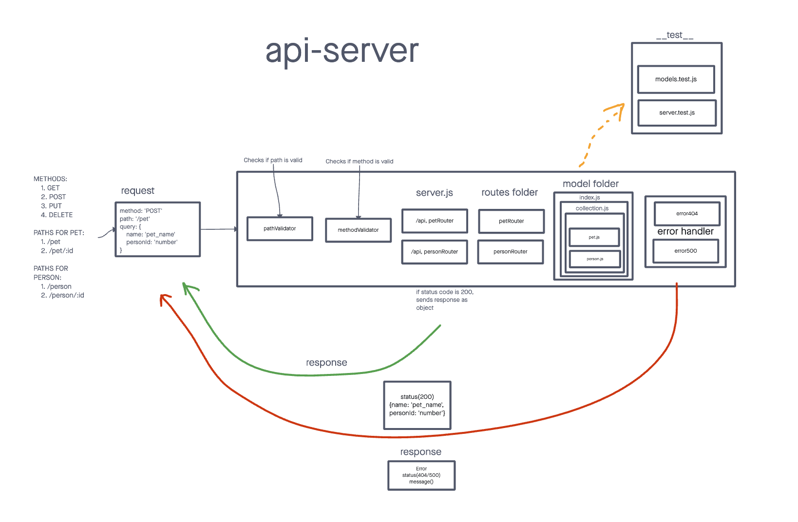
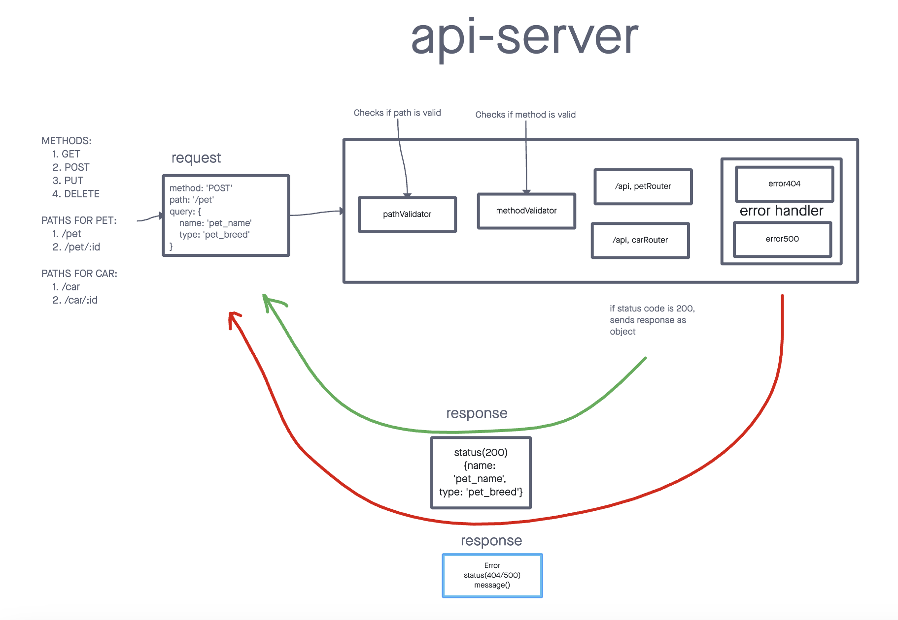

# API Server

>  Build a REST API using Express, by creating a proper series of endpoints that perform CRUD

## Installation

> Start with: `npm install`

> Set your PORT environment with an .env file

```text
PORT=3001
SQL_CONNECTION_STRING={SQL_database_link}
```

## Usage

Send a request:

```text
method: GET || POST || PUT || DELETE
route: /api/pet || /api/pet/:id || /api/person || /api/person/:id
query:
  name={name_of_person} //for person
  age={age_of_person} //for person
  
  name={name_of_pet} //for pet
  personId={person_id} //for pet
```

## UML Diagram



## Deployed link
> This is deployed on Render at:
* [Main/Production Branch](https://api-server-b4jj.onrender.com)

## PR link
[PR link Class 04](https://github.com/cleecoloma/api-server/pull/3)
[PR link Class 03](https://github.com/cleecoloma/api-server/pull/1)

## Code Review Pair Programming
* My partner was Samaad Turner
* My key takeaway from this code review was it benefits both the coder and the code reviewer. I believe this is because an outside set of eyes are usually better at looking at the code differently where as the actual code is sometimes have blinders on and can't see obvious missed or bad code.
* [My code review PR link](https://github.com/SamaadTurner/api-server/pull/2)
* [The reviewers PR link](https://github.com/cleecoloma/api-server/pull/2)
## Contributors
> Chester Lee Coloma