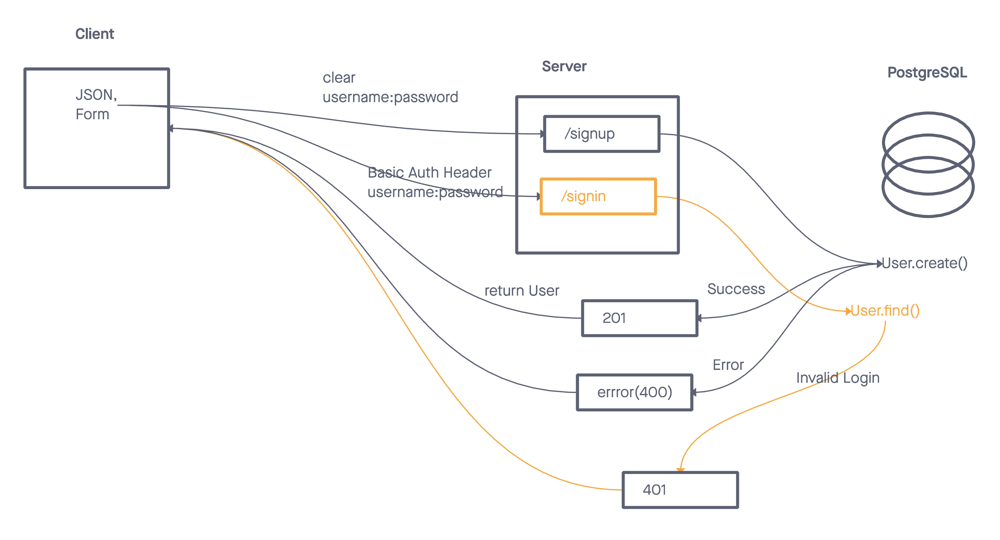

# Lab 06

Basic Auth server functionality

## Setup
- .env  requirements
  - PORT: Port Number to run server
  - DATABASE_URL: db connection string (defaults to sqlite if this isn't present)

## Running the app
- to install:
  - `npm install`
- to run:
  - `npm run dev`
- endpoints
  - /signup: returns created user via submitted JSON data
    - `{"username":"frank","password":"foo"}`
  - /signin: returns a valid auth request if username/password matches
    - `Basic username:password`
  
## Tests
- not added yet

## UML

