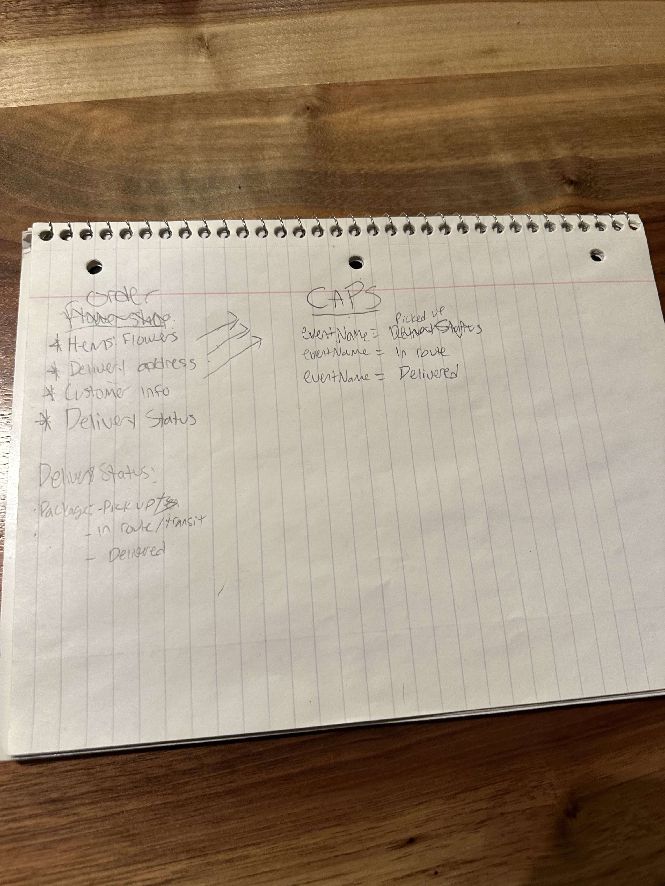

# CAPS - PARCEL SERVICE

# ABOUT
CAPS will simulate a delivery service where vendors (such a flower shops) will ship products using our delivery service and when our drivers deliver them, each vendor will be notified that their customers received what they purchased.

# How to run

-download and install neccessary node package things 
-npm start will out put the correct console things.

# UML

