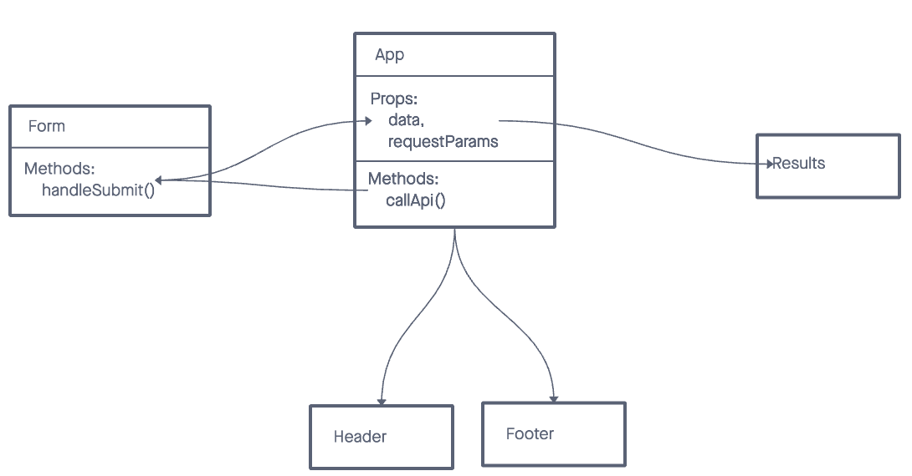

# RESTy
## Usage

This is a simple React application built with Vite. It includes components such as Header, Footer, and Results. The application fetches data from an API and displays the results.

## UML Diagram

## Installation

1. Clone the repository to your local machine.
2. Navigate to the project directory.
3. Run `npm install` to install the dependencies.
4. Run `npm run dev` to test the app.

## License
MIT

