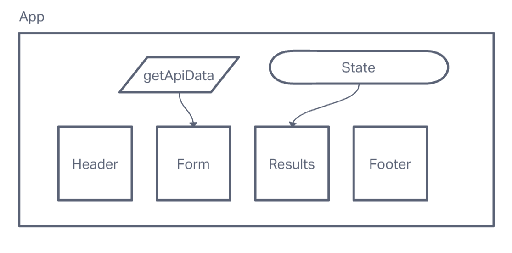

# resty
Lab 26 - Creating a RESTful front-end

# Whiteboard

## Dependencies
vite react

## Requirements
## Phase 4
### 1

Replace any component state managements to use derived state from useReducer() with a reducer function and initial state.

Use a reducer to store and manage all application state: loading, results, history.
Add to history array in state after every api call
method, url, results (json).

Iterates the history array in state and shows the previous API calls.
When one is clicked on, show the results in the results component.
Note: the results component renders whatever is in state.

## Phase 3
### 1
As a user, I want to enter the URL to an API and issue a GET request so that I can retrieve it’s data.
As a user, I want to see the results returned from an API request in my browser in a readable format.

<Form /> component, onSubmit() sends the user’s entries to the <App /> via method sent in through props.
<App /> does a check on the request data from the form and updates the request variable in state with the url, method, and potentially the body.
<App /> has an effect hook that’s looking for changes to the request variable in state, and in response, runs the API request with the new request options from state.
<App /> updates state with the results of the API Request.
<Results /> sees the new API data as a prop and renders the JSON. The JSON data should be complete. i.e. not only include results, but also include pagination data if present (next, previous and count), if using axios.

## Phase 2
### 1
User enters an API URL.
Chooses a REST Method.
Clicks the “Go” button.
Application fetches data from the URL given, with the method specified.
Displays the response headers and results separately.
Both headers and results should be “pretty printed” JSON.

### Tests
Utilize the React Testing Library framework installed with CRA.
Assert that upon form submission the resulting data will be rendered in the output area.
Consider leveraging a chatbot as needed.
Install the GitHub action that will auto-run your tests on all check-ins.

## Phase 1
### 1
- Convert all child components of <App /> from classes to functions.
- The <App /> component serves as the container for all sub-components of this application. Leave this component as a Class.
- Make sure all base styles for <App /> are included in a .scss imported within the App.jsx file.
- Ensure that the <Header />, <Footer />, <Results /> and <Form /> components are imported using ES6 import syntax.

### 2
- Each of the components should have its own scss file.

### 3
- <Form /> component should call a function **onSumbmit()** passed down from App that updates the App component.
- <Results /> should show mock API results.